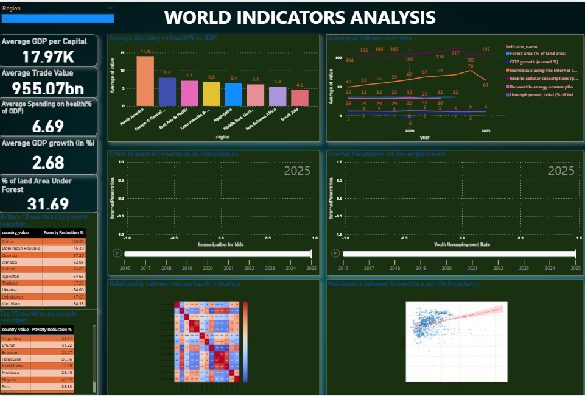
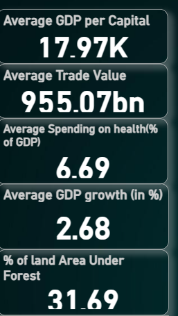
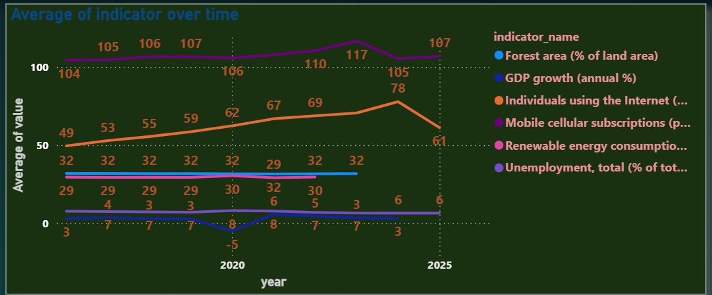
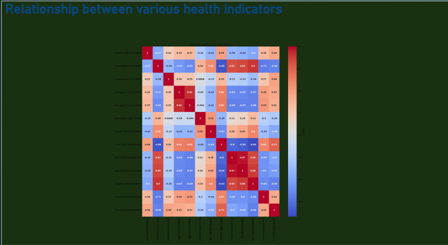
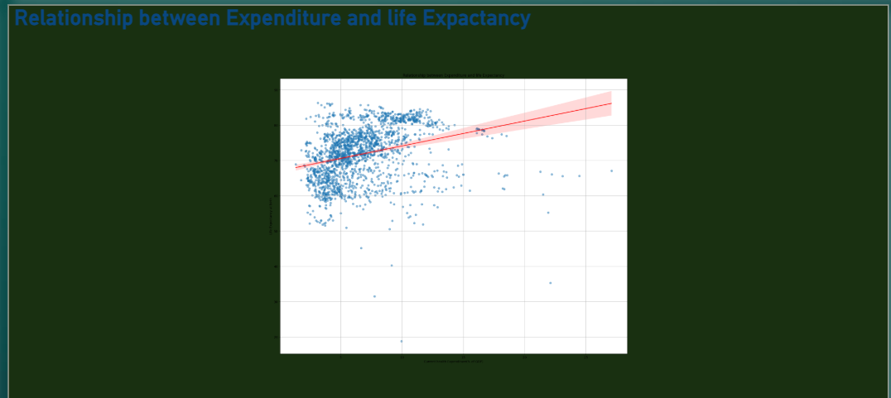
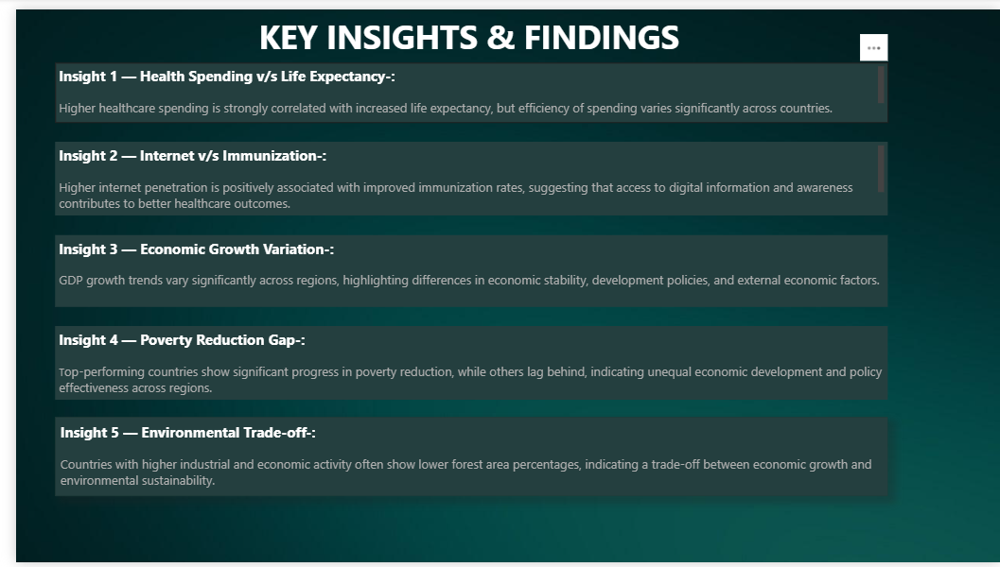

# 🌍 World Bank Global Indicators Analytics — End-to-End Business Insights Dashboard

An end-to-end **data analytics project** that simulates a real-world business scenario by analyzing global economic, health, and development indicators to uncover actionable insights for policy and decision-making.

---

## 📊 Dashboard Overview



---

## 📊 KPI Metrics



---

## 📊 Trend Analysis



---

## 📊 Advanced Analytics

### Correlation Analysis



### Regression Analysis



---

## 📊 Insights Page



---

## 📌 Project Overview

This project analyzes global development data to answer a key question:

👉 **How do economic, health, and technology factors influence a country’s growth and quality of life?**

Using the **World Bank API**, the project builds a complete data pipeline and an interactive dashboard to identify patterns, correlations, and regional disparities across countries.

---

## 💼 Business Problem

Global organizations and policymakers struggle to:

* Compare development indicators across countries
* Understand drivers of economic growth and health outcomes
* Identify gaps in poverty reduction and resource allocation

👉 The challenge is turning **complex, messy global data into actionable insights**.

---

## 🧰 Tech Stack

| Tool           | Purpose                          |
| -------------- | -------------------------------- |
| Python         | Data extraction and processing   |
| Pandas         | Data cleaning and transformation |
| Requests       | API calls                        |
| World Bank API | Data source                      |
| Power BI       | Data visualization               |
| Seaborn        | Statistical data visualization   |
| Matplotlib     | Data visualization & plotting    |

---

## 📚 Data Source

The data used in this project is retrieved from the **World Bank Open Data API**, which provides access to global development indicators across countries and years.

**World Bank API Documentation:**
https://datahelpdesk.worldbank.org/knowledgebase/articles/889386-developer-information-overview

**Example API Endpoint:**
https://api.worldbank.org/v2/country?format=json

**API Directory Listing:**
https://publicapi.dev/world-bank-api

---

### Data Coverage

The API provides information on:

* Economic indicators (GDP, trade)
* Labour market indicators
* Poverty and inequality
* Health statistics
* Environmental indicators
* Technology adoption

---

## ⚙️ Step-by-Step Approach

### 1️⃣ Data Extraction (API Layer)

* Extracted country-level and indicator metadata from the World Bank API
* Collected indicator values across multiple domains (economic, health, trade, environment, technology)

---

### 2️⃣ Data Cleaning & Transformation

* Normalized nested API responses into tabular format
* Standardized country identifiers
* Filtered data from **2016 onwards**
* Removed unnecessary columns and handled missing values

---

### 3️⃣ Data Modeling

* Segmented data into 7 analytical datasets
* Merged datasets with country-level attributes (region, income level)

---

### 4️⃣ Advanced Analytics

* Built a **correlation matrix (heatmap)** to analyze relationships between health indicators
* Performed **regression analysis** (health spending vs life expectancy)
* Identified key statistical relationships across indicators

---

### 5️⃣ Dashboard Development (Power BI)

Created an interactive dashboard with:

**KPI Metrics:**

* Average GDP per Capita
* Average Trade Value
* Average Health Spending (% of GDP)
* Average GDP Growth (%)
* % of Land Under Forest

**Visualizations:**

* Trend analysis over time
* Scatter plots (Internet vs Immunization)
* Correlation heatmap
* Regression analysis
* Top & Bottom 10 countries (poverty reduction)

**Filters:**

* Region-based slicer for comparative analysis

---

## 📊 Key Insights & Actions

### 📌 Health Spending vs Life Expectancy

Higher healthcare spending is positively correlated with life expectancy, but efficiency varies across countries.
👉 **Action:** Focus on optimizing healthcare allocation, not just increasing spending

---

### 📌 Internet Access vs Immunization

Countries with higher internet penetration show better immunization rates.
👉 **Action:** Digital awareness and access can significantly improve public health outcomes

---

### 📌 Economic Growth Variability

GDP growth differs significantly across regions, indicating uneven economic stability.
👉 **Action:** Region-specific economic policies are required

---

### 📌 Poverty Reduction Gap

Top-performing countries show strong poverty reduction, while others lag behind.
👉 **Action:** Benchmark high-performing countries

---

### 📌 Economic vs Environmental Trade-off

Higher economic activity often correlates with lower forest coverage.
👉 **Action:** Balance economic growth with sustainable environmental policies

---

## 📈 Impact & Learnings

### 🚀 Impact

* Transformed raw API data into a structured analytics solution
* Enabled cross-country comparison of key development indicators
* Delivered insights for policy-level decision-making

### 📚 Key Learnings

* Building scalable ETL pipelines using APIs
* Handling large real-world datasets
* Applying statistical analysis (correlation & regression)
* Designing business-focused dashboards
* Translating data into actionable insights

---

## 🏗 Project Architecture

```
World Bank API
↓
Python ETL Pipeline
↓
Raw Data (data/raw)
↓
Processed Data (data/processed)
↓
Power BI Dashboard
```

---

## 📂 Project Structure

```
world-bank-global-indicators-analytics
│
├── python
│   └── world_bank_pipeline.py
│
├── data
│   ├── raw
│   ├── processed
│
├── dashboard
│   ├── world_bank_dashboard.pbix
│   └── images/
│
└── README.md
```

---

## 👨‍💻 Author

**Pratham Mewara**

---

⭐ If you found this project valuable, consider giving it a star!
